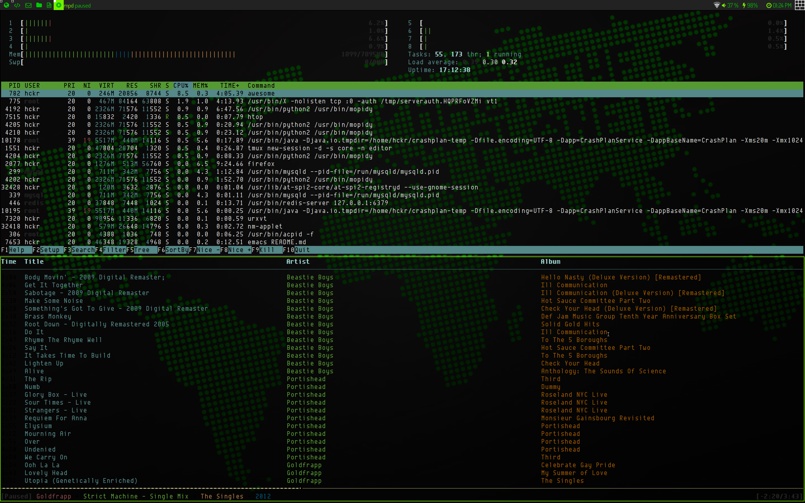

Glowing Hipster
----------------------

This beautiful piece of crap is my awesome wm config and theme, currently titled `Glowing Hipster` (a name suggested by Github as I made this repo).

It's "optimised" for HiDPI screens because I'm a hipster who uses a retina Macbook Pro.

What you need
================

  - [Awesome WM](http://awesome.naquadah.org/): the awesome window manager, awesome.
  - [Font Awesome](http://fortawesome.github.io/Font-Awesome/) [AUR](https://aur.archlinux.org/packages/ttf-font-awesome/): the font used for the icons in the taglist and widgets
  - [Dosis Font](http://www.fontsquirrel.com/fonts/dosis) [AUR](https://aur.archlinux.org/packages/ttf-google-fonts-git/): the font used for the rest of the theme

Installing the config and theme
================================

If, for some bizarre reason, you find you have a compelling urge to use this theme, you can clone the repo as your local `~/.config/awesome`:

    git clone git@github.com:hckr/glowing-hipster.git ~/.config/awesome

You will need to either get rid of your old not-as-`awesome` folder (`mv ~/.config/awesome{,.old}`), or..something.

Screenshot
============

